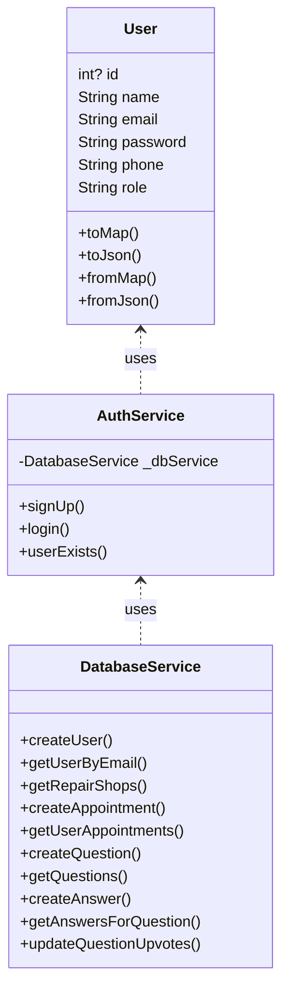
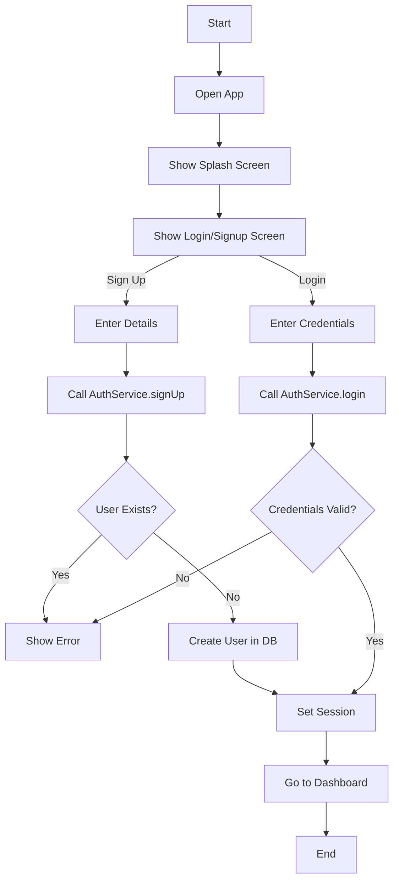
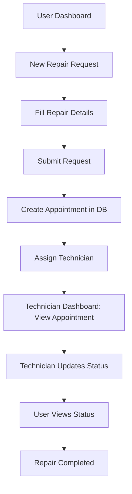
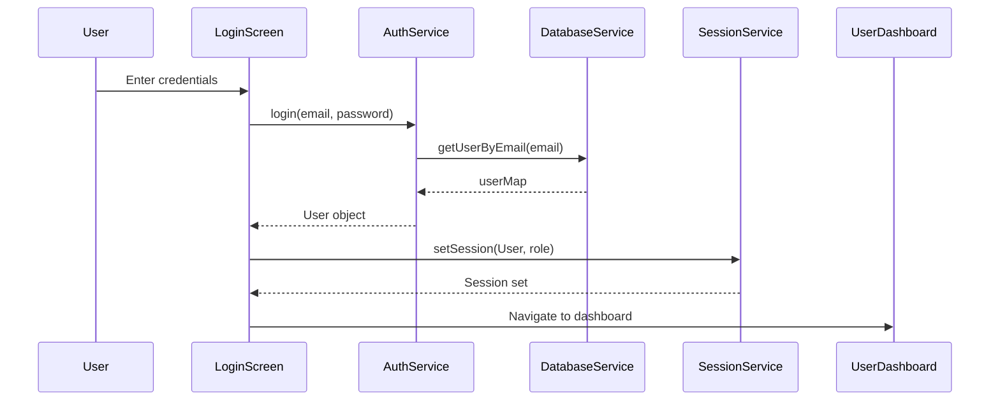
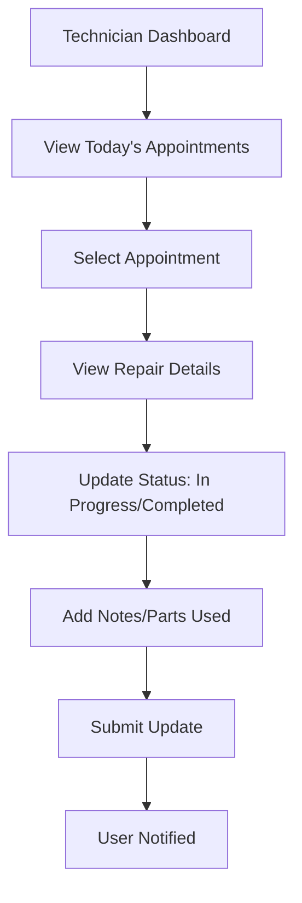
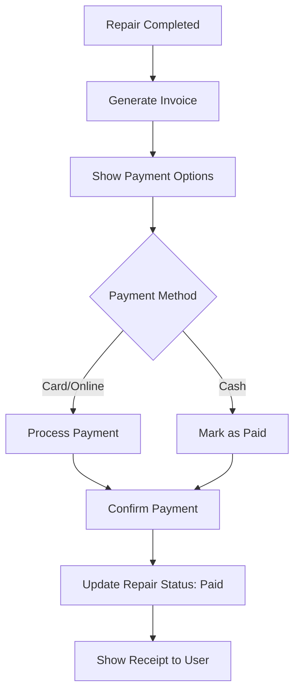
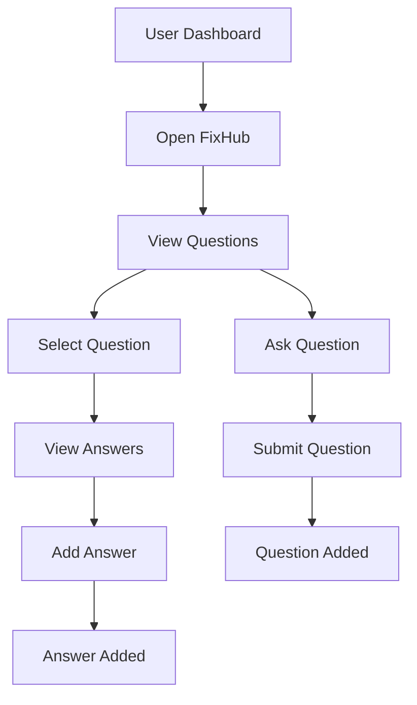

# Mobile Repairing Application Prototype

This project is a Flutter-based mobile repairing application prototype. It features user and technician dashboards, authentication, repair request workflows, and a Q&A community (FixHub).

---

## Table of Contents
- [Class Diagram](#class-diagram)
- [Activity Diagram: User Sign Up & Login](#activity-diagram-user-sign-up--login)
- [Workflow Diagram: Repair Request](#workflow-diagram-repair-request)
- [Sequence Diagram: User Books Repair](#sequence-diagram-user-books-repair)
- [Technician Workflow](#technician-workflow)
- [Payment Workflow](#payment-workflow)
- [FixHub Q&A Workflow](#fixhub-qa-workflow)

---

## Class Diagram

---

## Activity Diagram: User Sign Up & Login

---

## Workflow Diagram: Repair Request

---

## Sequence Diagram: User Books Repair

---

## Technician Workflow

---

## Payment Workflow

---

## FixHub Q&A Workflow

